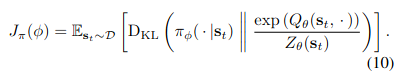

# Eqn 1 and it's code
[paper described in the code](https://arxiv.org/pdf/1801.01290.pdf)

## The RLAlgorithm File:
This contains the actual training code. This is where the agent is given data and chooses an action, the loss is calculated and the alg learns this all occurs in _train()

## DIAYN._sample_z():
> Samples z from p(z) using the probabilities in self._p_z

## DIAYN._init_critic_update():
> Creates minimization operation for critic Q-function 
> I belive this is where the actual algorithm does it's work.
> * The method creates a tf.optimizer.minimize operation which update the Q-function with gradient descent and appends it to self._training_ops
> > "See Equation (10) in [1] for further information of the Q-function update rules"

> > Not sure where eqn 10 is, I do not see it in the paper...
 ```python
  self._qf_t = self._qf.get_output_for(self._obs_pl, self._action_pl, reuse=True) 
 ```
> p(z) gets updated on line **184**
> The log(p(z)) is referenced on **186**
> "reward_pl" (reward policy)? gets updated **188**, **189** 

## DIAYN._init_actor_update():
Creates minimization operations for policy and state value functions
The separate function for state value function approximation stailizess training. Equations (8, 13)


> 46         Args: <br/>
> 47             base_kwargs (dict): dictionary of base arguments that are directly<br/>
> 48                 passed to the base `RLAlgorithm` constructor.<br/>
> 49             env (`rllab.Env`): rllab environment object.<br/>
> 50             policy: (`rllab.NNPolicy`): A policy function approximator.<br/>
> 51             discriminator: (`rllab.NNPolicy`): A discriminator for z.<br/>
> 52             qf (`ValueFunction`): Q-function approximator.<br/>
> 53             vf (`ValueFunction`): Soft value function approximator.<br/>
> 54             pool (`PoolBase`): Replay buffer to add gathered samples to.<br/>
> 55             plotter (`QFPolicyPlotter`): Plotter instance to be used for<br/>
> 56                 visualizing Q-function during training.<br/>
> 57             lr (`float`): Learning rate used for the function approximators.<br/>
> 58             scale_entropy (`float`): Scaling factor for entropy.<br/>
> 59             discount (`float`): Discount factor for Q-function updates.<br/>
> 60             tau (`float`): Soft value function target update weight.<br/>
> 61             num_skills (`int`): Number of skills/options to learn.<br/>
> 62             save_full_state (`bool`): If True, save the full class in the<br/>
> 63                 snapshot. See `self.get_snapshot` for more information.<br/>
> 64             find_best_skill_interval (`int`): How often to recompute the best<br/>
> 65                 skill.<br/>
> 66             best_skill_n_rollouts (`int`): When finding the best skill, how<br/>
> 67                 many rollouts to do per skill.<br/>
> 68             include_actions (`bool`): Whether to pass actions to the<br/>
> 69                 discriminator.<br/>
> 70             add_p_z (`bool`): Whether th include log p(z) in the pseudo-reward.<br/>
> 71         """
>
1. get policy distribution
2. set log_pi_t to the log_p_t of the _policy_dist
3. Set the v_f


## upper level summary
* The minimization operation for updating the Q-function is created in _init_critic_update()
* The minimization operations for the policy and state value functions occur in _init_actor_update()
* The discriminator update function is _init_discriminator_update()
* The _evaluate() function evaluates the current policy
* _get_best_single_option_policy() find the best single option policy

